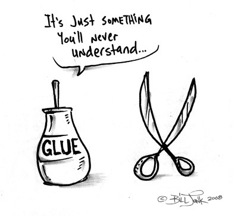

We use mocks, stubs or fakes when writing tests, mostly using a mocking framework of choice ([Moq](https://github.com/Moq/moq4), [RhinoMocks](http://hibernatingrhinos.com/oss/rhino-mocks), [NSubstitute](http://nsubstitute.github.io)).

The **reason** why we do this is to isolate our _System under test (SUT)_ from it's dependencies.

We want to **avoid repeating** ourselves and test the same logical code block (method, property, class, condition, ...) multiple times.

## What's wrong with it?

In fact there is nothing wrong with it, apart from a **misunderstanding** of _'System under test'_.

> Do you really feel that the class you are testing is a system on it's own?

Unless you are developing a framework, the answer in most cases should be no.

## What do we need to make mocking possible?

Most of the mocking frameworks need a way to intercept calls, either by marking the method (or property) as virtual or by introducing an interface.

As virtual method's (or properties) tend to be a bit on the annoying side, we just **introduce interfaces everywhere**. Named equally to it's implementation class, prefixed with 'I' as good convention abiding citizens do.

By doing this we just **ignore the reason of existence** of an interface. An interface should exist if there are more implementations available or you want to open it up for extension!

> A good practice before introducing an interface is to find a meaningful name for it without the 'I' prefix. If the best you can come up with is the classname itself you might not need it.

## Does it hurt?

If abused, it can block you from making changes to the code base. Which is in direct contrast with the reason you added them in the first place.

It can **'glue'** your classes together in a way that refactoring parts of the system can only result in changing a lot of tests or even worse, throwing them out of the window. Even if the outcome of the SUT is the same as before.

> Tests are supposed to help you, not work against you!

## Ideal justifications for adapting a test?

#### Good

1. You made the wrong assumption in the first place
2. The requirement changed

#### Bad

- Object composition changes
- Refactoring
