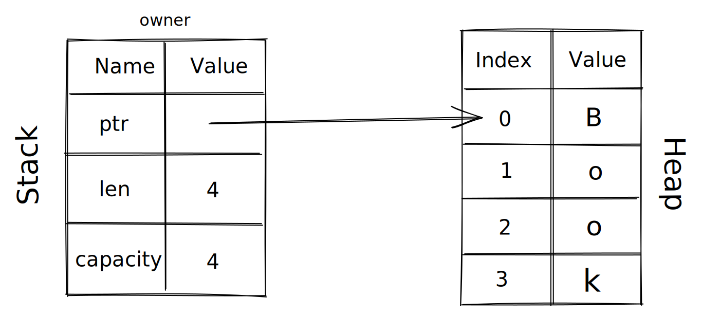
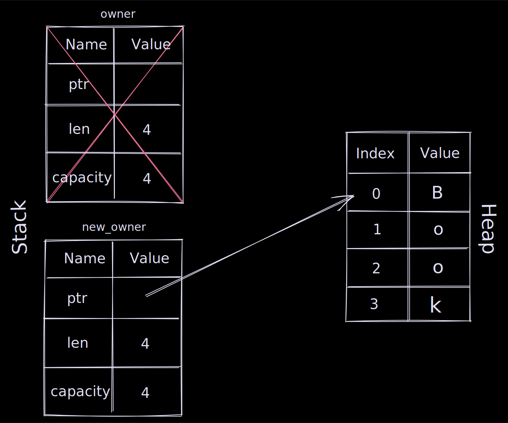

Rust does not manage it's memory using [Garbage collection](<https://en.wikipedia.org/wiki/Garbage_collection_(computer_science)>) or trough explicit (de-)allocation but uses a concept called **"ownership"** based on explicit rules.

In this post we will focus on values with an unknown size at compile time in other words values that are stored on the ["Heap"](https://www.geeksforgeeks.org/stack-vs-heap-memory-allocation/).

### 1. Each value has an owner

```rust
// The variable 'owner' owns the String "Book"
let owner = String::from("Book");
```

#### Memory layout



A string's data is dynamic so it lives on the heap, the pointer, the length and capacity (the preallocated/reserved space before new memory needs to be allocated) lives on the stack.

### 2. There can only be one owner at a time

```rust
let owner = String::from("Book");

// The variable new_owner now becomes the owner of the String,
// in rust this is called a move.
let new_owner = owner;

println!("{0}", owner); // 💥 Compilation Error 💥
```

#### The compiler's output is just amazing ❤️

```bash
▶ cargo run
   Compiling package v0.1.0 (/path)
error[E0382]: borrow of moved value: `owner`
  --> src/main.rs:10:21
   |
4  |     let owner = String::from("Book");
   |         ----- move occurs because `owner` has type `String`,
                   which does not implement the `Copy` trait
...
8  |     let new_owner = owner;
   |                     ----- value moved here
9  |
10 |     println!("{0}", owner); // 💥 Compilation Error 💥
   |                     ^^^^^ value borrowed here after move
   |
```

#### Memory layout



The moment `new_owner` receives ownership of the value, the stack based pointer (incl len + capacity) gets removed from memory.

#### A move also occurs when we pass a variable to a function

```rust
fn main() {
    let book = String::from("Refactoring");

    give(book); // Gives away ownership

    // 💥 Compilation Error 💥
    println!("book no longer owns the book: {}", book);
}

fn give(book: String) {
    println!("i received ownership of the book: {}", book);
}
```

#### Returning a value from a function passes ownership to caller 💪

```rust
let owner = receive_book();

fn receive_book() -> String {
    String::from("The Clean Coder")
}
```

### 3. When the owner goes out of scope, the value gets dropped

```rust
fn main() {
    let book = String::from("The Clean Coder"); // book exists

    { // another scope starts

        // scoped_book exists
        let scoped_book = String::from("Cast away");

        // can access both here
        println!("{book} & {scoped_book}");

    } // scoped_book goes out of scope (aka drop)

    // here only book exists, scoped_book has been dropped!
    println!("{}", book);
} // book gets dropped
```

The moment the owner goes out of scope, memory gets deallocated immediately! The scope created by `{}` is actually a technique to have even more control over how long a value should exist.
