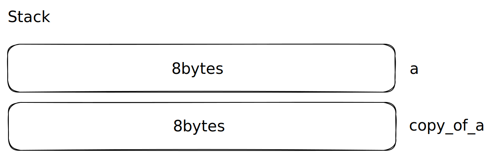

When we talked about [ownership](/blog/2023/03/17/what-is-ownership) in Rust, we've excluded values who's size are known at compile time, but what happens to a value that is stored on the `Stack`:

```rust
let mut a: i32 = 2;

// Here the value is copied
let copy_of_a: i32 = a;

a = 3;

// 🖨️ Amount copied: 2 🖨️
println!("Amount copied: {}", copy_of_a);
```

The 32-bits integer (8 bytes) is copied when we assign it to the variable `copy_of_a`. The same would have happened if we passed it to a function as a parameter.

#### Memory layout



> This is basically the reason why [`useEffect`](https://react.dev/reference/react/useEffect#useeffect) in React has a dependency array, the function is memoized and the value is enclosed/copied inside the scope!

### Point struct

What if we wanted to create a `Point` type that behaves like a value?

```rust
pub struct Point {
    pub x: i32,
    pub y: i32,
}

fn main() {
    let mut point = Point { x: 0, y: 0 };

    // Here the ownership will be transferred, aka a move
    let point_is_moved = point;

    point.x = 5; // 💥 Compilation Error 💥
}

```

#### Compiler's output

```bash
✦ ▶ cargo -q run
error[E0382]: assign to part of moved value: `point`
 --> src/main.rs:9:5
  |
4 |     let mut point = Point { x: 0, y: 0 };
  |         --------- move occurs because `point` has type `Point`,
                      which does not implement the `Copy` trait
...
7 |     let point_is_moved = point;
  |                          ----- value moved here
8 |
9 |     point.x = 5;
  |     ^^^^^^^^^^^ value partially assigned here after move
```

### [Clone](https://doc.rust-lang.org/std/clone/trait.Clone.html)

If we look at other types in rust we'll notice that some of them have a `Clone` method ([String](https://doc.rust-lang.org/std/string/struct.String.html#impl-Clone-for-String)), we could implement that for our type:

```rust
fn main() {
    let mut point = Point { x: 0, y: 0 };

    // we clone the value
    let point_is_moved = point.clone();

    point.x = 5;

    // 🖨️ Point copied: { x: 0, y: 0 } 🖨️
    println!("Point copied: {:?}", point_is_moved);
}

#[derive(Debug)]
pub struct Point {
    pub x: i32,
    pub y: i32,
}

impl Clone for Point {
    fn clone(&self) -> Self {
        Point {
            x: self.x,
            y: self.y,
        }
    }
}
```

Implementing the `Clone` trait is a very explicit way of create a copy, which may or may not be expensive.

We can also derive from the `Clone` trait 💪:

```rust
#[derive(Debug, Clone)]
pub struct Point {
    pub x: i32,
    pub y: i32,
}
```

### [Copy](https://doc.rust-lang.org/std/marker/trait.Copy.html)

But what we said we really wanted to mimic the copy behavior of for instance `i32`? That is the beauty of the Rust language ❤️,, there is actually a supertrait of `Clone` which can be derived from :

```rust
fn main() {
    let mut point = Point { x: 0, y: 0 };

    // we copy the value like `i32`
    let point_is_moved = point;

    point.x = 5;

    // 🖨️ Point copied: { x: 0, y: 0 } 🖨️
    println!("Point copied: {:?}", point_is_moved);
}

#[derive(Debug, Copy, Clone)]
pub struct Point {
    pub x: i32,
    pub y: i32,
}

```

To be able to derive from the `Copy` trait, all of the underlying values must implement `Copy`! This is the main difference with `Clone`, Copy is inexpensive.
